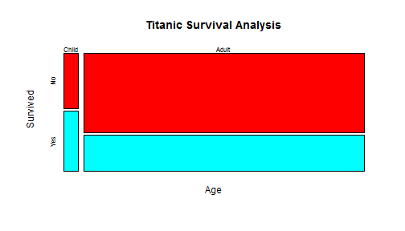
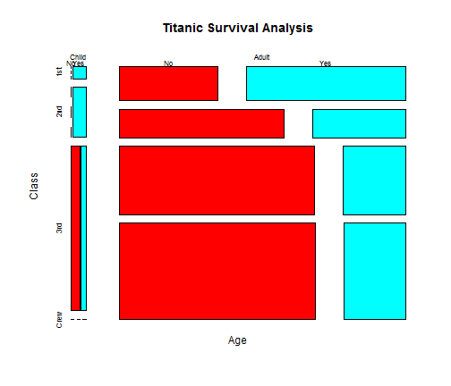

## 1. Background

RMS Titanic (<http://en.wikipedia.org/wiki/RMS_Titanic>) was a British passenger liner that sank in the North Atlantic Ocean in the early morning of 15 April 1912 after colliding with an iceberg during her maiden voyage from Southampton, UK to New York City, US. The sinking resulted in the loss of more than 1,500 passengers and crew making it one of the deadliest commercial peacetime maritime disasters in modern history.  The disaster was greeted with worldwide shock and outrage at the huge loss of life and the regulatory and operational failures that had led to it. Public inquiries in Britain and the United States led to major improvements in maritime safety.
  
This tragedy is famous for saving "women and children first".  Hence, this Shiny application is developed for users to have a better 
understanding of the survival of passengers and crews breakdown by Age, Class and Sex. For the purpose of this project, this Shiny 
application uses the "Titanic" R dataset. 

--- .class #id 

## 2. How to use "Titanic Survival Analysis" App

This is a simple web application for you to analyze the fate of passengers on the fatal maiden voyage of the ocean liner Titanic, by summarizing survival according to Age, Class (economic status), and Sex.

1. Please run the app at <http://charmaineafy.shinyapps.io/PROJECT>.

2. Source code of app at <https://github.com/charmaineafy/M9_Developing_Data_Products>.

3. On the left panel, you can check or uncheck one or more of the checkbox(es) to control the display of the mosiac plot.

4. On the right panel, the mosiac plot will be refreshed automatically upon any changes to the checkboxes. The plot allows user to compare the survivors by the chosen dimensions (Age, Class, Sex).

5. After analyzing the plots, the user may input findings and then print them together with the plot.

--- .class #id 

## 3. Use Case: Survival Analysis by Single Dimension
If user selects only one check-box (either Age, Class, Sex), a mosaic plot and a cross-table (of 2 dimensions) will be displayed. Below is an example when user selected "Age".

 

```
##        Survived
## Age      Yes   No  Sum
##   Child   57   52  109
##   Adult  654 1438 2092
##   Sum    711 1490 2201
```

--- .class #id 

## 4. Use Case: Survival Analysis by Multiple Dimensions
If user selects two or more check-box (from Age, Class, Sex), a mosaic plot will be displayed. Below is an example when user selected "Age" and "Class". Note: Currently, Shiny App does not support cross-table more than 2 dimensions.

 


